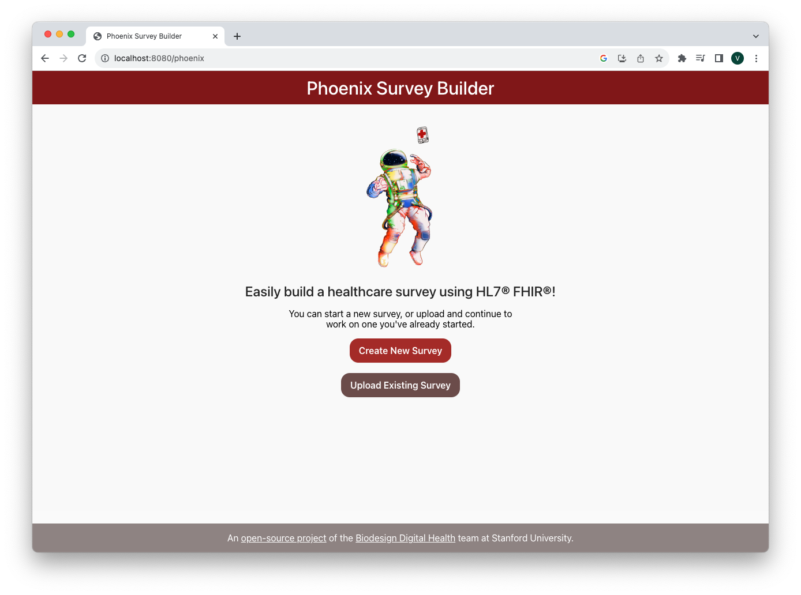

# Phoenix Survey Builder

[](https://github.com/StanfordBDHG/phoenix/actions/workflows/build-and-test.yml)

A web application that allows you to build healthcare surveys using the [HL7® FHIR® Questionnaire](https://www.hl7.org/fhir/questionnaire.html) international data standard using an interactive, drag-and-drop interface, and export JSON to be used in CardinalKit/Spezi iOS and Android applications to deliver surveys to patients.



## Features
- Drag and drop survey creation
- Exports surveys as HL7® FHIR® Questionnaires
- Upload and continue editing existing surveys
- Set skip logic and validation rules

## Requirements
- Node.js & npm

## Getting Started
- To use the application online, visit https://stanfordbdhg.github.io/phoenix

## Run for Development
- First, ensure that Node.js (version 16 or greater) and npm are installed on your system.
- Clone this repository and run `npm install` in the root directory.
- Run `npm start` to start the application in development mode.
- Open `localhost:3000/phoenix` in your browser to view the application.

## Build for Production
- First, ensure that Node.js (version 16 or greater) and npm are installed on your system.
- Clone this repository and run `npm install` in the root directory.
- Run `npm run build` in the root directory.
- The build files will be found in the `build/` subdirectory. You may deploy these files to the static web hosting service of your choice.

## Build and Run in Docker
- First, build the docker image:
```
docker build -t phoenix-survey-builder
```
- Then, run the docker image:
```
docker run -p 8080:80 phoenix-survey-builder
```
(You may substitute `8080` in the command above with a different port of your choice if needed.)

- Open `localhost:8080/phoenix` in your browser to view the application.

## Deploy to GitHub Pages
The repository contains a GitHub Action that will deploy the application to GitHub pages: [deploy.yml](https://github.com/StanfordBDHG/phoenix/blob/dockerize/.github/workflows/deploy.yml). 

Before using the action:
- Update `package.json` with the full GitHub pages URL for your repository in the `homepage` key, i.e. `https://username.github.io/repository`.
- Update the main route path in `src/router/index.tsx` with your repository name:
```
<Route path="/YOUR_REPOSITORY_NAME" exact>
...
```

## Contributors & License
The Phoenix Survey Builder is licensed under the [MIT license](LICENSE).

Phoenix is based on the [Structor](https://github.com/helsenorge/structor) project. We are grateful to the [Helse Norge](https://github.com/helsenorge) team for open-sourcing their work.

## Disclaimer
HL7®, and FHIR® are the registered trademarks of Health Level Seven International and their use of these trademarks does not constitute an endorsement by HL7.

This software is not intended to be a medical device.


